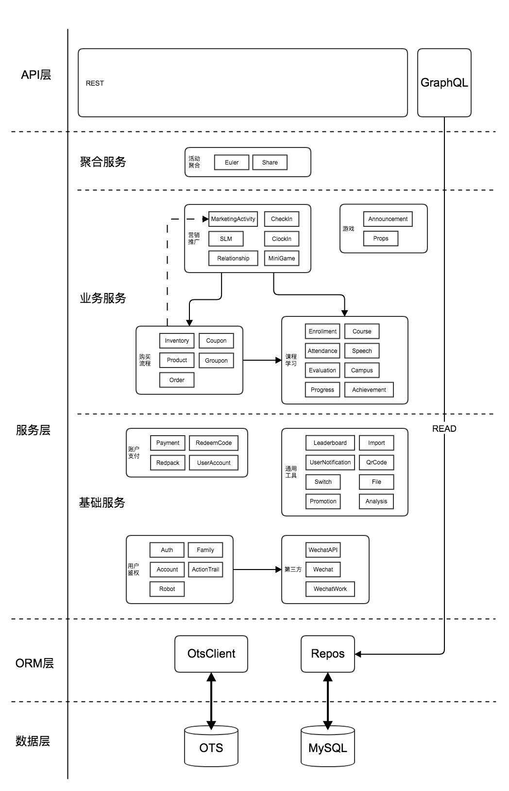

# 后端架构设计

## 整体架构



## 依赖注入

我们使用[typedi](https://github.com/typestack/typedi)作为依赖注入框架。

### 避免使用 constructor 注入

Constructor 注入虽然方便，但在出现循环依赖等复杂情况时灵活性和稳定性不足，所以我们建议大家使用属性注入替代。

```js
// GOOD
@Service()
class ServiceA {
  @Inject()
  private serviceB: ServiceB;
}

// BAD
@Service()
class ServiceA {
  constructor(private serviceB: ServiceB) {}
}
```

### 解决循环引用

[官方文档](https://github.com/typestack/typedi#problem-with-circular-references)

发生循环引用时，一般可以通过给 `@Inject()`添加类型回调函数解决，如 `@Inject(type => ServiceA)`。

**需要注意的是**，通常循环引用意味着

1. 模块间的责任分工不明
1. 单个模块的责任过多（非单一责任设计）
1. 缺少合理的抽象层

这些问题应该最终通过调整架构设计并重构解决。
